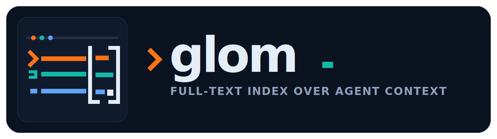

# glom

<p align="center">
  
</p>

<p align="center">
  <em>Ridiculously over-the-top AI generated logo for a package that does basically nothing.</em>
</p>

I'm constantly trying to find things in the event logs stored by my coding agents:
"when did we do this again? What was the context surrounding this change?"

Here's a tool to index and full-text search over agent context stored in `~/.claude` and `~/.codex`.

glom walks both directories, parses every discoverable file — session
transcripts, memory files, plans, tasks, skills, instructions, settings,
history — and stores the content in a local SQLite database with FTS5
full-text indexing.  Session JSONL files also get structured tool-call
extraction (tool name, input, output, error status, line number), stored in
a separate searchable table.

Session document search indexes human-facing transcript text. Structured tool
payloads and repeated session metadata stay in the dedicated `tool_calls`
table instead of being duplicated into document search.

## Install

```
uv tool install git+https://github.com/femtomc/glom
```

## Usage

### Index

```
glom index          # incremental (mtime-based, skips unchanged files)
glom index --full   # force full re-index
glom index --json   # compact diagnostics for scripts
```

Bulk mode (deferred FTS rebuild) activates automatically when >100 files
need processing. JSON output reports skipped malformed JSONL lines, parse
errors by source/kind, slowest files, largest files, and sessions with the
most extracted tool calls.

### Search documents

```
glom search "bellman orchestration"
glom search "feedback" -k memory          # filter by kind
glom search "monadic core" -p tiny        # filter by project slug
glom search "protocol" -s claude -n 5     # filter by source, limit results
glom search "renderer" --repo synth       # filter project slug or path
glom search "release" --since 2026-04-01  # filter by file mtime
glom search "macro" --path memories       # filter by path substring
glom search "deploy" --json               # compact JSON for exact fields
```

Kinds: `memory`, `plan`, `task`, `session`, `skill`, `instructions`,
`settings`, `history`.

Search output includes short refs like `@1`.  Refs persist in the local index,
so `glom show @1` displays the first document from the most recent document
search or context command.

### Bundle context

```
glom context "benchmark suites" --repo synth
glom context "git status" --path sessions --json
```

`context` returns ranked document hits with nearby transcript/document lines.
For session documents it also includes tool calls from the same session.

### Search tool calls

```
glom tools "git push" -t Bash             # search Bash calls for "git push"
glom tools '"pyproject.toml"' -t Read     # phrase search (FTS5 syntax)
glom tools "zig build" --repo synth       # filter project slug or path
glom tools "error" --since 2026-04-01     # filter by session file mtime
glom tools --names                        # list all tool names with counts
glom tools "error" --json                 # compact JSON for downstream parsing
```

### Inspect

```
glom stats                                # index statistics
glom doctor                               # source-root and DB health checks
glom optimize                             # FTS optimize + WAL checkpoint
glom optimize --rebuild-fts --vacuum      # heavier DB maintenance
glom show ~/.codex/memories/MEMORY.md               # display a document
glom show MEMORY.md                       # suffix match
glom show @1                              # last search/context result ref
```

Prefer the default compact text for exploratory agent work. All commands
support compact `--json`, but use it on purpose: exact fields, downstream
parsing, or records that the text view intentionally truncates or omits.

## What gets indexed

| Kind | Source files |
|---|---|
| `session` | `projects/*/*.jsonl`, `sessions/*/*/*/*.jsonl` |
| `memory` | `projects/*/memory/*.md`, `memories/*.md`, `memories/rollout_summaries/*.md` |
| `plan` | `plans/*.md` |
| `task` | `tasks/*/*.json` |
| `skill` | `skills/*/SKILL.md` |
| `instructions` | `CLAUDE.md`, `AGENTS.md`, project-level `CLAUDE.md` |
| `settings` | `settings.json`, `config.toml` |
| `history` | `history.jsonl` |

Session files also produce structured `tool_calls` rows with tool name,
input arguments, output text, error flag, and source line number.

## Configuration

Set `GLOM_DB` to override the database path (default:
`~/.local/share/glom/index.db`).
